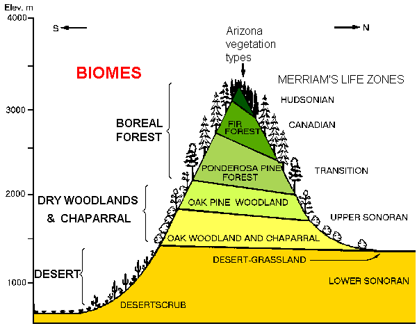
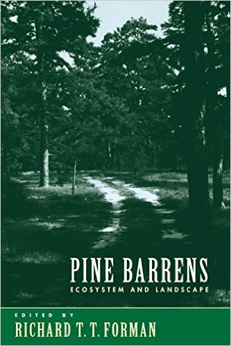

<!-- * Me -->
# 
<!-- Ecology = science of why organisms live where they live -->
<!-- + plant range map -->

# 
<!-- - Scales of ecological investigation -->

# 
<!-- ** California: Oaks, Redwoods and Dunes -->

# 
<!-- ** Arizona: Creosote and Pine -->

<!-- ** Mass: Harvard Forest -->
# 

# 
<!-- ** Trees (Cottonwoods), Ants and Pitcher Plants -->

# 

# 

<!-- ### Naturalism and Life Zones -->
<!-- - Henry David Thoureau -->
# 

<!-- - C. Hart Merriem -->
# 
<!-- - Ecological Society of America Founded 1915 -->

# 

# 
<!-- - Cowles -->

# 

<!-- ### ESA and the Community Concept -->
# 

# 
<!-- - The Dust-Bowl -->
<!-- - The New Deal and the CCC and The Nature Conservancy -->

# 
<!-- - WWII, The Green Revolution (= Agricultural Concentration) -->

# 
<!-- - Post-agrarian old fields (Earl Core)  -->

# 

# 

<!-- ### Modern Ecology: Food Webs and the Ecosystem Concept -->

# 
<!-- - The Atomic Age and Cold War Ecology = Radio Isotopes and Ecosystem Ecology -->

# 
<!-- + Hutchinson -->

# 
<!-- + HT Odum -->

# 
<!-- MacArthur = Quantitative and rigorously theoretical -->

<!-- - Island Biogeography: MacArthur, Wilson and Simberloff -->
# 

# 

# 

# 

# 

# 
<!-- - Silent Spring, Rachel Carson -->
# 

# 

<!-- - Endangered Species Act, Clean Air and Water Acts and the EPA -->
# 

<!-- ### Post-modern Community Ecology: Diversity, Stability and Interactions -->
# 
<!-- - Invasive species and Ecosystem Meltdown -->

# 
<!-- - Keystone species, Ecosystem Engineers and Foundation Species -->

# 
<!-- + Robert Paine: Keystones and Disturbance -->

# 
<!-- - Post-cold War: Microbes = Mycorrhizal Fungi and Foliar Endophytes -->

# 
<!-- ### Spatial-Landscape Ecology -->
<!-- - Roots in Biogeography -->
# 
<!-- - Landscape Connectivity: Beier and Foreman -->

# 
<!-- + Pine Barrens: Ecosystem and Landscape -->
<!-- - Foreman: Landscape Ecology and Road Ecology -->

# 
<!-- - GIS and Species Distribution Modeling -->

# 
<!-- ### Modern Challenges -->
# 
<!-- - Climate Change = Sea level rise -->

# 
<!-- + http://sealevel.climatecentral.org/ -->

# 

# 

# 

# 

# 
<!-- + Planting for the future? (1000cords) -->

# 
<!-- - Urban and Agro-Ecology -->
<!-- + Ecological Urbanism and Brown Fields -->
<!-- + Biological Scaling (Brown and West) -->

# 

# 
<!-- cities and fields -->

# 

# 

# 

# 

# 

<!-- - Modernism: rejecting natural humanity -->
<!-- - How do we perceive nature? -->
<!-- - Ecologists have excluded humans because humans do some crazy things. -->
<!-- - This dichotomy has lead to a challenge in ecology where ecology sets humans apart -->
<!-- Ecology can faciltitate a liaison among disciplines and our -->
<!-- interaction with the rest of our world -->  

<!-- - Quiz: What do you think? -->
<!-- - Two examples: Romantic vs Modern -->
<!-- ### Q&A: Approaching complex issues of culture, design and ecology -->

# 

# 
<!-- ### Perceptions: Human-Nature and Art -->

